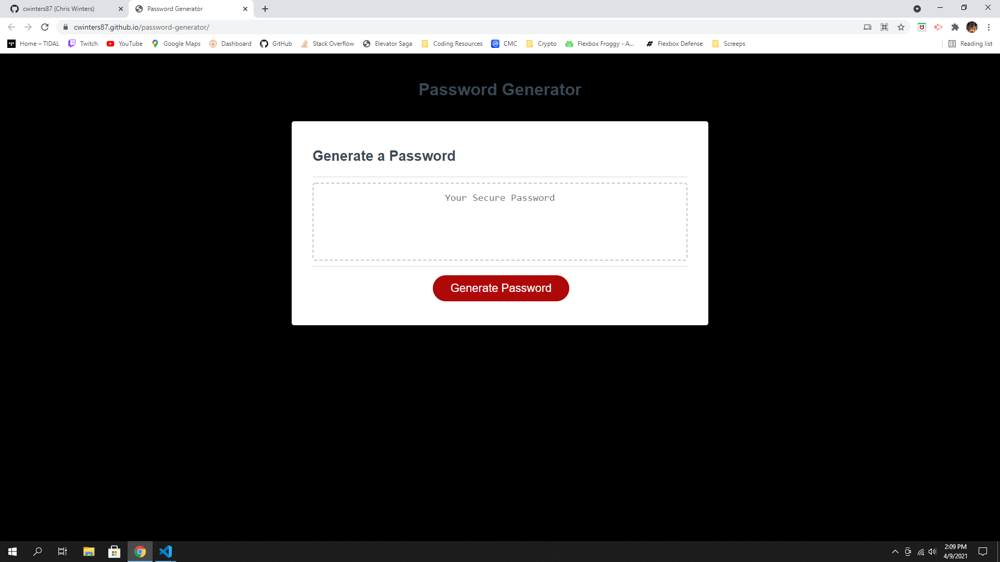

# Password Generator Application

## I was provided the HTML and CSS code for this project and a few lines of JavaScript. 
## Using the requirements for the project I created an application with use of Object and Arrays to move around the functions and values to a foreach loop to create a generated password
## I changed the background to black as it is my preference to a have a dark mode setting.

### Application deployed here:
https://cwinters87.github.io/password-generator/

### The site should render as such:

